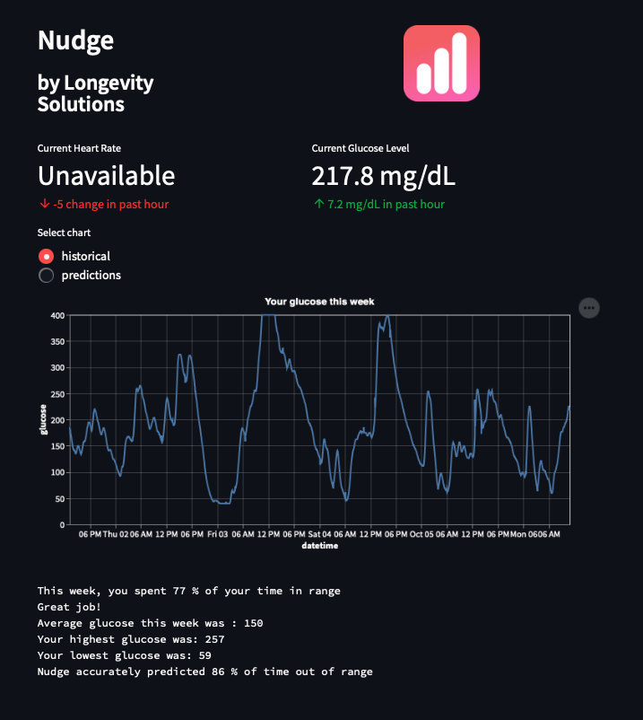

# Nudge in Streamlit

### This Streamlit app displays user glucose levels with machine learning predictions of future glucose levels 30 minutes in advance
#### The goal is to provide user with advance warning of high glucose levels

#### Summary stats describe weekly glucose behavior

#### Machine learning model uses linear regression and random forest to create an averaged prediction which performs better than either alogorithm independently 